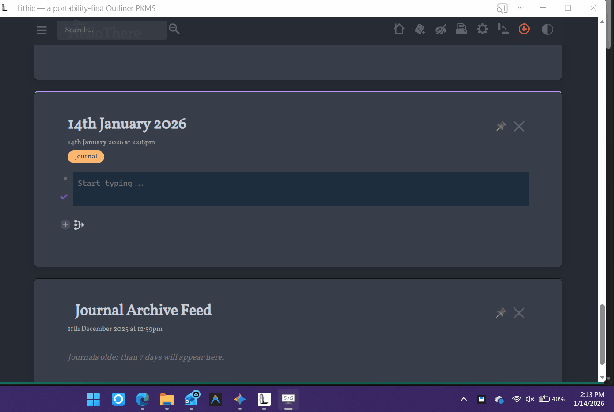

# Ephemeral

**Ephemeral** is a lightweight, daemonless utility for Windows that instantly executes code snippets from your clipboard inside isolated, secure Podman containers.



## Prerequisites
1.  **Virtualization:** Enabled in BIOS/UEFI.
2.  **WSL2:** Run `wsl --install` via PowerShell.
3.  **Podman:** [Install Podman for Windows](https://podman.io/docs/installation#windows), then run `podman machine init` and `podman machine start`.

## Installation & Build
1.  Install Python 3.10+.
2.  Install dependencies: `pip install -r requirements.txt`
3.  Run: `python ephemeral.py`

To build a standalone EXE:
```bash
pyinstaller --noconsole --onefile --name "Ephemeral" --hidden-import=pystray ephemeral.py
```

## Usage
1.  **Copy** any code block (Markdown or raw text).
2.  **Press** `Ctrl+Alt+X`.
3.  **Paste** the result.

If no language is detected (no markdown tag or shebang), a terminal will prompt you to define it.

## Declarative Image Mode
You are not limited to the built-in languages. You can run *any* Docker/Podman image by defining the `image` and `cmd` parameters directly in the markdown header.

**Example: Running FreeBASIC via a custom declarative header:**

```text
```my_custom_test image=primeimages/freebasic cmd="bash -c 'cat > /tmp/run.bas && fbc /tmp/run.bas && /tmp/run'"
Print "This code is running inside a declarative container definition!"
Print "Ephemeral downloaded the image and ran the build chain automatically."
```
```

## Supported Languages
Ephemeral supports version pinning (e.g., `python:2.7`, `node:14`).

**Built-in Support:**
05ab1e, ArnoldC, Bash, Befunge, Brainfuck, C, C++, CJam, Clojure, Common Lisp, Crystal, Elixir, Emojicode, Fish (><>), Fortran, FreeBASIC, Go, GolfScript, Haskell, Hexagony, Intercal, Java, Jelly, Julia, Lolcode, Lua, Malbolge, MATL, Nim, Node.js, OCaml, Octave, Perl, PHP, Piet, PowerShell, Prolog, Python, R, Ruby, Rust, Science Python, Shakespeare, Unlambda, Verilog, Whitespace.

## Cache Management
To free up disk space, right-click the generic tray icon and select **"Clear Image Cache"**. This executes `podman image prune -a`.

## Todo
* **File Artifacts:** Add mechanism to retrieve arbitrary files (images, binaries) generated inside the container.
* **Multi-Block Execution:** Support for running multiple sequential codeblocks found in a single clipboard copy.
* **Seed Files:** Support for injecting data files (json, csv, etc.) into the container context before execution.
