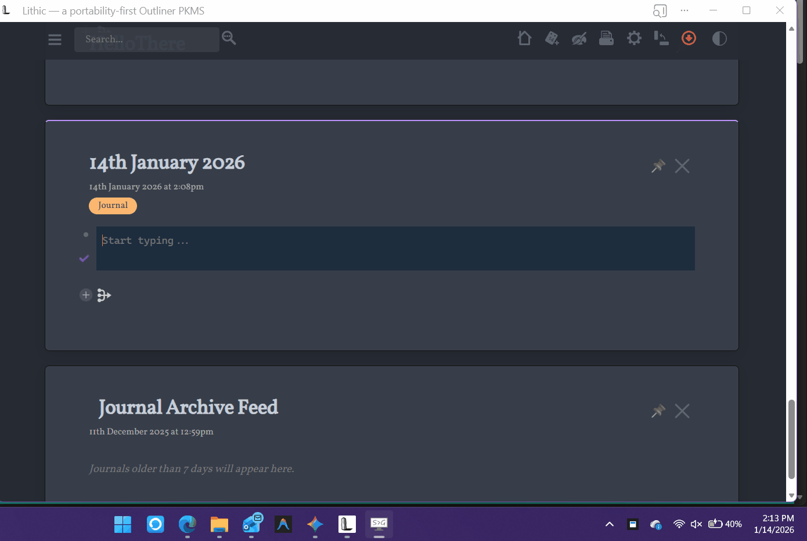

# Ephemeral.exe

**Ephemeral** is a **one-shot** sandboxed code execution engine that parses Markdown for codeblocks, runs them in isolated Podman containers, and extracts generated artifacts. Rather than acting as a long-running daemon or task scheduler, Ephemeral serves as a stateless, on-demand processing pipeline — much like a Jupyter Notebook cell execution for your desktop or server. It can be used as a **Windows tray application** (clipboard-driven) or as a **FastAPI server** (for remote sidecar execution).




## The Problem

Windows is a fantastic OS, but it lacks the native "polyglot" flexibility of Linux. 
* Installing Python, Ruby, Node, Go, Rust, and Perl just to run a quick snippet is overkill.
* Managing multiple versions (Python 2.7 vs 3.10) is a nightmare of environment paths.
* Copying code from a textbook, StackOverflow, or your PKMS (Obsidian/Logseq) usually involves opening a heavy IDE, creating a file, saving it, and running it.


## The Ephemeral Solution

Ephemeral acts as a **one-shot "Sidecar Notebook"** processing pipeline for your entire operating system. It leverages **Podman** (via WSL2) to create instant, disposable execution environments that spin up, run your pipeline, return outputs/artifacts, and vanish.


### Why you want this:
1.  **Language Versatility:** Run Bash, Python, Ruby, R, Julia, Octave, C++, Rust, and more without installing them locally.
2.  **Clean System:** No more `npm_modules` or stray `.py` files cluttering your desktop. The container lives for milliseconds and vanishes.
3.  **Security:** Snippets run in a sandbox (`--network none`). A malicious `rm -rf /` only deletes a temporary container, not your hard drive.
4.  **Legacy Support:** Need to test a script in Python 2.7? Just type `python:2.7`. Ephemeral pulls the specific version for that run.
5.  **Context Agnostic:** It works anywhere you can copy text. 

## Architecture

Ephemeral uses a modular, dual-entry-point architecture. The core execution engine is platform-agnostic and can be driven by either a local Windows tray app or a remote FastAPI server.

```
ephemeral_core/          ← Platform-agnostic engine (parsing + Podman orchestration)
├── config.py            ← Language map (50+ languages), network & chaining flags
├── parser.py            ← Markdown codeblock extraction & runtime resolution
├── executor.py          ← Async container execution via parse_and_execute()
├── models.py            ← ExecutionResult, GroupResult, BlockResult dataclasses
└── __init__.py

main_local.py            ← Windows tray client (clipboard → Podman → clipboard)
main_api.py              ← FastAPI server (POST /ephemeral/api/v1/run, base64 payloads)
install.sh               ← One-shot sidecar deployment (systemd + rootless Podman)
```

### Running Modes

| Mode | Entry Point | Artifacts Route To |
|---|---|---|
| **Tray** (default) | `main_local.py` | Clipboard (images) or `~/Downloads` (files) |
| **One-shot** | `main_local.py script.md` | Same as tray, then exits |
| **Headless CLI** | `ephemeral.exe --cli script.md` | Current working directory |
| **API Server** | `uvicorn main_api:app` | `/data/ephemeral/` (WebDAV mount) |
| **Sidecar Deploy** | `sudo ./install.sh` | systemd service on port 8787 |


### Distributed Tier & Trust Model

Ephemeral is expanding into a multi-tier distributed architecture built on the [iroh](https://www.iroh.computer) peer-to-peer networking library. The distributed tiers share the same `ephemeral_core` engine and a common networking core (`ephemeral_net`) that adds a peer-to-peer job network on top:

**Client/server thickness** (thinnest → thickest): *paper-thin* clients — the future static-URL REST API (curl-friendly, no WASM required); *thin* clients — the browser WASM SPA; *thick* clients — the desktop tray apps; *thick servers* — the self-hosted gateways.

**Implemented so far:** `ephemeral_net` Phase 1 (QUIC transport, hello handshake, seed-mediated discovery, job streaming over one connection) and Phase 2 (receiver-side sandboxing — image allowlist, `unsafe` stripped, `image=`/`cmd=`/`entrypoint=` overrides ignored, `--memory 2g`/`--cpus 2`/`--pids-limit 512`/`--network none` enforced — plus nearest-neighbor offloading: when an image isn't warm locally, the job forwards to the nearest node that has it while the image pulls in the background). `ephemeral-self-host-distributed` Phase 2.5 ships as `main_distributed.py` (a REST gateway that joins the cluster as a compute node; `pip install -r requirements-api.txt -r requirements-net.txt` and run `uvicorn main_distributed:app`, configured via `EPHEMERAL_RELAY`, `EPHEMERAL_SEEDS`, `EPHEMERAL_SECRET`, `EPHEMERAL_ALLOW_NETWORK`). Phase 3 ships the browser WebAssembly client (below) and the `ephemeral-distributed` desktop tier (`main_distributed_client.py`), and both desktop tiers build for Windows (EXE) and Linux (AppImage) — see **Release artifacts**.

| Package | Role | Runtime | Trust Model |
|---|---|---|---|
| `ephemeral-wasm-library` | Browser thin client (SPA) translating REST-style jobs into the distributed network | Browser (WebAssembly) | **Public** — good-faith |
| `ephemeral-distributed` | Desktop tray app: local execution, compute node, and nearest-neighbor offloading | Windows EXE + Linux AppImage | Public or private |
| `ephemeral-self-host-distributed` | Headless compute node + REST gateway for self-hosting (Docker/Coolify) | Linux container (Dockerfile) / source tarball | Public or private |
| `ephemeral-local` | Local-only desktop tray app (clipboard-driven, Podman) | Windows EXE + Linux AppImage | **Private** — nothing ever leaves the machine |

> **Trust Model & Privacy — please read before using the distributed tiers.**
> The public distributed network is a *good-faith* model designed for teaching (e.g., college students and professors running code snippets). **Anything you submit to the public ephemeral cloud should be treated as public knowledge — there is no privacy guarantee.** It is not security-first or trust-first: other network participants may be able to observe submitted code and outputs, and the shared public relays carry no uptime or performance guarantees.
> If you need privacy, **self-host instead** and use the non-distributed packages (`main_local.py` / `main_api.py`, or `ephemeral-self-host-distributed` on infrastructure you control).

### Web thin client (`ephemeral-wasm-library`)

Phase 3 ships a browser-side WebAssembly client that speaks the **same wire protocol** as the Python tiers (`hello` handshake + `job_request` → `job_log`/`job_done`/`error` over iroh QUIC bi-streams), so it interoperates with Python compute nodes with zero translation. Browsers cannot hole-punch, so all browser↔cluster traffic traverses an iroh relay — n0's public relays by default, or a self-hosted one via the Relay URL field.

The SPA thin client lives in `ephemeral-wasm-library/web/` (vanilla JS — no framework). To run it:

```bash
cd ephemeral-wasm-library/web && python -m http.server 8787
# open http://localhost:8787 and run code — no ticket pasting needed.
```

**Discovery is automagic.** The client ships with a small bootstrap config in `web/config.js` (relay URL + seed `EndpointTicket`s) compiled into the bundle — this is configuration, not a job-routing dependency, so the execution path still runs entirely over the iroh network with no HTTP endpoint. On load the client dials the seed(s), completes the `hello` handshake, and learns the whole cluster from the seed's peer table (dialable tickets + warm images). Jobs then route automatically to the best available compute node — a peer whose warm images cover the document's languages first, then lowest RTT. A manual seed-ticket field remains as an override for operators, and the *Cluster* panel lists discovered nodes with their images and latency.

To rebuild the wasm module: `cd ephemeral-wasm-library && bash build.sh` (see `build.sh` for the toolchain requirements — a stable Rust toolchain with the `wasm32-unknown-unknown` target, a wasm-capable clang for `ring`'s C files such as wasi-sdk, and the `wasm-bindgen` CLI pinned to 0.2.127). The built glue is committed under `web/wbg/` so the SPA works without a Rust toolchain.

### Desktop tiers & Linux AppImages

The desktop tray clients (`main_local.py` local-only, `main_distributed_client.py` distributed) are cross-platform: the same code builds a Windows EXE (PyInstaller) and a Linux **AppImage** (PyInstaller onedir + appimagetool, via `packaging/build_appimage.sh local|distributed`). Platform plumbing is guarded: the language prompt uses zenity/kdialog/tkinter on Linux, image-clipboard uses wl-copy/xclip, login autostart writes a `~/.config/autostart/ephemeral.desktop` entry, and Podman lifecycle uses the native rootless socket (`systemctl --user start podman.socket`) instead of `podman machine`. The AppImage needs a desktop with a StatusNotifier/AppIndicator host (most GNOME/KDE setups) or an X11 session (pystray's Xorg backend); on hosts without FUSE, run it with `APPIMAGE_EXTRACT_AND_RUN=1`. Both apps also expose `--cli script.md` (headless) and `--self-check` (install verification) modes.

### Release artifacts

The CI workflow (`/.github/workflows/build.yml`) builds and attaches **six artifacts** to each release (triggered via the `workflow_dispatch` → *Create a new release* checkbox, or a push to `main`):

| Artifact | Tier | Notes |
|---|---|---|
| `Ephemeral.exe` | local (Windows) | one-file EXE |
| `Ephemeral-Distributed.exe` | distributed (Windows) | one-file EXE, bundles `iroh` |
| `ephemeral-local-x86_64.AppImage` | local (Linux) | portable tray app |
| `ephemeral-distributed-x86_64.AppImage` | distributed (Linux) | portable tray app, bundles `iroh` |
| `ephemeral-wasm-library.tar.gz` | web (browser) | SPA + wasm glue + crate source to rebuild |
| `ephemeral-self-host-distributed.tar.gz` | self-host (distributed server) | cluster gateway source + `Dockerfile` for Docker/Coolify |
| `ephemeral-self-host.tar.gz` | self-host (local API server) | plain REST gateway (`main_api.py`, no networking tier) + `Dockerfile.api` — the build bundled by Lithic-UK |

Run an AppImage like any executable: `chmod +x ephemeral-distributed-x86_64.AppImage && ./ephemeral-distributed-x86_64.AppImage` (configure the cluster via `EPHEMERAL_SEEDS`/`EPHEMERAL_RELAY`/`EPHEMERAL_SECRET`/`EPHEMERAL_ALLOW_NETWORK` environment variables, as with the Windows build). For the self-host tiers, `docker build -f Dockerfile -t ephemeral-self-host-distributed .` (distributed) or `docker build -f Dockerfile.api -t ephemeral-self-host .` (local API), and mount the host Podman socket (`-v /run/podman/podman.sock:/run/podman/podman.sock`) so the node can execute jobs.

## Prerequisites
Before running Ephemeral, you must ensure your Windows environment is ready to host Linux containers.


1.  **Enable Virtualization (BIOS/UEFI):**
    * Ensure **Virtualization Technology** (often labeled VT-x, AMD-V, or SVM) is enabled in your computer's BIOS/UEFI settings. This is strictly required for WSL2 to function.


2.  **Enable WSL2:**
    * Open PowerShell as Administrator and run: `wsl --install`
    * Restart your computer if prompted.


3.  **Install Podman for Windows:**
    * Download the installer from the [Podman Website](https://podman.io/docs/installation#windows).
    * Run the installer.
    * Open a terminal and initialize the machine:

        ```powershell
        podman machine init
        ```

    * *Note: Ephemeral will attempt to auto-start the machine if it's stopped, but the initial `init` setup usually requires manual intervention.*

## Usage


1.  **Highlight & Copy** any code block (or click the "Copy Code" button found on many documentation sites):
2.  **Press** `Ctrl+Alt+X` (or left click the Tray Icon, or right click and use the menu).
3.  **Wait** for the notification (or the status window if a download is required).
4.  **Paste** the result wherever you need it.


*Note: Ephemeral supports Markdown blocks with language tags, Shebang lines (`#!/bin/python`), and prompts for user-input if no language specified.*

A test suite file is provided in the repo to demonstration the usage of the various supported langauges.

## Features

### Manual Language Entry & History

If you copy raw text without a language tag (e.g., no ` ```python `), Ephemeral will pop up a terminal window asking you to specify the language. 

* It remembers your last used language for rapid iteration.
* Simply press **Enter** to use the default/last-used language.


### Smart Markdown Parsing

Ephemeral is built to forgive messy clipboard copies. You don't need to perfectly select only the codeblock!
* **Explanation Ignoring:** It gracefully ignores any explanatory text, formatting, or paragraphs outside of triple backticks. You can copy an entire tutorial with interstitial codeblocks and explanations, and Ephemeral will only extract and execute the code.
* **Wrapper Filtering:** It automatically detects and strips outer markdown wrappers (like ` ````text `) commonly used on documentation sites or chat apps to display nested blocks.
* **Orphaned Backticks:** Incomplete or trailing backticks are ignored; it exclusively extracts well-formed triple-backtick pairs.
* **Shebang Overrides:** If your code contains a shebang (e.g., `#!/usr/bin/node`), Ephemeral prioritizes it over the markdown language tag. For example, a ` ```python ` block containing `#!/bin/bash` will be correctly executed as Bash.

**Example: Copying a full tutorial document**
You can safely copy all the text below and Ephemeral will only execute the code block:
`````
````text
Welcome to my Python tutorial! First we will import the math module.
As you can see this text is not code, but Ephemeral will ignore it.

```python
import math
print("Pi is:", math.pi)
```

And that concludes the tutorial!
````
`````

**Example output:**
````
## Result (Python)

```text
Pi is: 3.141592653589793
```
````

### Legacy Versioning
You can override the default "Latest" version by appending a tag to the language name in your markdown block or shebang:


* `python:2.7` -> Runs in `python:2.7` container.
* `node:14` -> Runs in `node:14-alpine`.
* `ruby-2.6` -> Runs in `ruby:2.6`.


If no version is specified, it defaults to the stable/slim versions defined in the tool.


### Cache Management

Ephemeral downloads container images as needed. Over time, these can take up disk space.
* **Right-click** the tray icon and select **"Clear Image Cache"**.
* This runs a safe prune command (`podman image prune -a`) to delete all images not currently in use, freeing up space on your drive.

### Artifacts & File Exports

Ephemeral isn't just for text output. You can generate images, compile binaries, or create documents directly from your snippets.

**How it works:**
Any file your script saves to the **`/output`** directory inside the container is automatically captured:

1.  **Images (Plots/Graphs):** If a single image (PNG, JPG, BMP) is generated, it is automatically converted to a bitmap and copied to your **Clipboard**, ready to paste immediately.
2.  **Documents & Binaries:** If a non-image file is generated (e.g., PDF, DOCX, EXE), it is extracted and moved to your **Downloads** folder.
3.  **Multiple Files:** If your script generates multiple files, they are automatically zipped into a timestamped archive and saved to **Downloads**.

**Example (Python Plotting):**
```python
#!science
import matplotlib.pyplot as plt
import numpy as np

# Generate Data
x = np.linspace(0, 10, 100)
y = np.sin(x)

# Create Plot
plt.figure(figsize=(6, 4))
plt.plot(x, y, label='Sine Wave', color='blue')
plt.title("Generated via Ephemeral")
plt.legend()
plt.grid(True)

# Save to /output to trigger auto-clipboard copy
plt.savefig('/output/plot.png')
```

### Multi-Block Execution

Ephemeral supports running multiple sequential codeblocks from a single clipboard copy. If multiple codeblocks use the same language and configuration, Ephemeral automatically groups them into a single container run. Since they execute in the same container, filesystem state is preserved between the blocks.

**Example:**
````text
```python
# Block 1 (Python container starts)
with open("/tmp/shared.txt", "w") as f:
    f.write("42")
print("Saved 42 to /tmp/shared.txt")
```

```python
# Block 2 (Runs in the same Python container)
# Filesystem state is preserved between these blocks!
with open("/tmp/shared.txt", "r") as f:
    val = f.read()
print(f"Read shared value: {val}")
```

```node
// Block 3 (Switches to a new Node.js container)
console.log("This runs in a completely separate, fresh environment.");
```
````

**Example output:**
````text
## Run 1 (Python)

### Step 1 (Python)
```text
Saved 42 to /tmp/shared.txt
```

### Step 2 (Python)
```text
Read shared value: 42
```

## Run 2 (Node)

```text
This runs in a completely separate, fresh environment.
```
````

### Container Chaining (Piping)

By default, in multi-container executions (e.g., executing a Python block, followed by a Node.js block), any artifacts written to the `/output` directory in one container are automatically passed down to the root directory of the **following container**. This makes it incredibly easy to pipe data across entirely different language environments.

If you wish to prevent this behavior (for example, to isolate containers completely), you can append the `nopiping` or `nopipe` parameter to your block header.

**Example: Passing data from Python to Node.js**
````text
```python
# Container 1 (Python)
import json

data = {"user": "Alice", "score": 42}
with open("/output/data.json", "w") as f:
    json.dump(data, f)
print("Data written to /output/data.json")
```

```node
// Container 2 (Node.js)
// The data.json file from the previous container is automatically injected here!
const fs = require('fs');

const data = JSON.parse(fs.readFileSync('data.json', 'utf8'));
console.log(`Hello ${data.user}, your score is ${data.score}!`);
```
````

**Example output:**
````text
## Run 1 (Python)

```text
Data written to /output/data.json
```

## Run 2 (Node)

```text
Hello Alice, your score is 42!
```
````

### Seed Files & Binary Data

You can inject data files (like JSON, CSV, or text) into the container environment before your code executes. To do this, provide the filename as the language tag in the markdown header (e.g., `data.json` or `file data.json`). 

**Base64 Binary Seeding:** You can also seed binary files (like images or compiled data) by appending `b64` to the header. Ephemeral will automatically decode the base64 string back into the original binary file inside the container before your code runs.

**Conversion Hotkey:** To make seeding effortless, Ephemeral includes a conversion hotkey (`Ctrl+Win+X`). If you copy an image, a file in your file explorer, or raw text to your clipboard and press `Ctrl+Win+X`, Ephemeral will automatically convert it into the correct markdown seed block format (including base64 encoding if necessary) and replace your clipboard content, ready to be pasted!

*(Note: When using the hotkey on a copied file, Ephemeral will name the file `seed.<ext>` inside the container. It will also append `source=<original_name>` to the header just as informational metadata so you can remember where the data came from.)*

**Example (Text and Binary Seeds):**
````text
```data.json
{
  "message": "Hello from seed file!"
}
```

```seed.png b64 source=image.png
iVBORw0KGgoAAAANSUhEUgAAAAEAAAABCAQAAAC1HAwCAAAAC0lEQVR42mNk+A8AAQUBAScY42YAAAAASUVORK5CYII=
```

```python
import json
import os

with open('data.json', 'r') as f:
    print(json.load(f)['message'])

print(f"Image exists: {os.path.exists('seed.png')}")
```
````

**Example output:**
````text
## Result (Python)

```text
Hello from seed file!
Image exists: True
```
````

### No Local File Mounting

Ephemeral intentionally does **not** have a mechanism to 'mount' or bind local directories into the container (aside from the secure `/output` drop folder). This is an intentional design decision for two key reasons:
1. **Reproducibility**: Ephemeral codeblocks are envisioned to be entirely self-contained. By forcing data to be declared inside the markdown (via seed files), the snippet is guaranteed to run on any machine without relying on hidden external file structures.
2. **Security**: Preventing local mounts reduces the possibility of local data-harvesting or ransomware payloads scanning your host machine's hard drive when running untrusted code with the `unsafe` network flag enabled. (see below)


### Automatic Python Dependency Resolution

For Python blocks, Ephemeral resolves third-party packages automatically — no `unsafe` flag and no inline metadata required.

1. **Implicit dependency injection:** Ephemeral scans your Python code for `import` statements, filters out standard-library modules, and injects a [PEP 723](https://peps.python.org/pep-0723/) `# /// script` header declaring the inferred packages before the block is sent to the container.
2. **Two-stage sandboxed resolution:** When inferred dependencies exist and you did *not* opt into `unsafe`, the block runs in two container stages instead of one:
    - **Stage A** starts a container *with* network access and installs the dependencies into a virtual environment on a shared volume.
    - **Stage C** starts a fresh container *without* network access (`--network none`) and runs your payload using that environment's interpreter.

Your payload never sees the network — only the package-resolution step does. If you already wrote your own PEP 723 metadata, it is respected as-is (no re-injection), and if you do use `unsafe`, dependencies resolve in the normal single-stage mode.

**Example (no `unsafe`, no comments needed):**
```python
#!python
import requests
response = requests.get('https://httpbin.org/get')
print("Successfully resolved and executed offline:", response.status_code)
```

### Network Access (Unsafe Mode)

By default, Ephemeral runs all containers with network access disabled (`--network none`) to ensure a secure, sandboxed execution environment. If your snippet needs to download dependencies or interact with web APIs, you can append the `unsafe` keyword to your language tag to enable internet access.

> [!WARNING]
> **Security Risk:** Using `unsafe` removes the network sandbox, allowing the container to communicate externally. Be cautious when using this mode, especially with untrusted code, as malicious artifacts could be downloaded or your environment could be compromised.

**Example:**
```python
#!python unsafe
import urllib.request
response = urllib.request.urlopen('http://httpbin.org/get')
print("Successfully connected to the internet!")
```

## Supported Languages

05ab1e, Bash, Brainfuck, C, C++, CJam, Clojure, Common Lisp, Crystal, Elixir, Fortran, FreeBASIC, 
Go, GolfScript, Haskell, Java, Julia, Lolcode, Lua, Nim, Node.js, OCaml, Octave, Perl, PHP, Piet, 
PowerShell, Prolog, Python, R, Ruby, Rust, Science Python, Verilog.
## Declarative Image Mode
You are not limited to the built-in languages. You can run *any* Docker/Podman image by defining the `image` and `cmd` parameters directly in the markdown header.

**Example: Running COBOL via a custom declarative header:**

````text
```cobol image=esolang/cobol cmd="sh -c 'cat > /tmp/run.cob && cobc -x -free -o /tmp/run /tmp/run.cob && /tmp/run'"
IDENTIFICATION DIVISION.
PROGRAM-ID. DECLARATIVE-TEST.
PROCEDURE DIVISION.
    DISPLAY "Markdown: COBOL (Declarative) | Math Check: " 45 " - OK".
    STOP RUN.
```
````

> If you would like to have a built-in language added to the language map please open a pull request, preferrably containing a declarative example as above for me to test.

## Building from Source (with Ephemeral!)

Ephemeral can build itself! If you already have a working copy of Ephemeral, you can update to the latest version by copying and executing this snippet. It fetches the latest source from GitHub, cross-compiles a Windows `.exe` using PyWine, and drops it into your `\Downloads` folder:

````text
```pywine unsafe
# Fetch latest source from GitHub
wine python -c "import urllib.request, zipfile, io; zipfile.ZipFile(io.BytesIO(urllib.request.urlopen('https://github.com/Xyvir/Ephemeral.exe/archive/refs/heads/main.zip').read())).extractall()"
cd Ephemeral.exe-main

# Install all dependencies
wine python -m pip install -r requirements.txt pyinstaller Pillow

# Generate icon
wine python -c "from PIL import Image, ImageDraw; img=Image.new('RGB', (64, 64), (30, 30, 30)); dc=ImageDraw.Draw(img); dc.rectangle((16,16,48,48), fill=(255,255,255)); dc.rectangle((20,20,44,28), fill=(0,120,215)); img.save('ephemeral.ico')"

# Inject build timestamp as version
sed -i "s/Version number (injected from the github workflow)/LOCAL_$(date +%Y%m%d-%H%M%S)/g" main_local.py

# Build — main_local.py is the entry point, ephemeral_core is bundled as a hidden import
wine pyinstaller --noconsole --onefile --name Ephemeral --icon=ephemeral.ico --hidden-import=ephemeral_core main_local.py
cp dist/Ephemeral.exe /output/
```
````

> **Note:** This is not the primary build pipeline — it's a convenience for self-updating. The official builds use GitHub Actions (see below).

## CI/CD Pipeline

The official build pipeline uses GitHub Actions (`.github/workflows/build.yml`) with three stages:

1.  **Test** — Runs `test_core.py` + `test_api.py` on `ubuntu-latest` across Python 3.10 and 3.12.
2.  **Build** — Builds the Windows `.exe` via PyInstaller on `windows-latest`.
3.  **Release** — Creates a GitHub Release with the artifact (manual dispatch only).

## CLI Mode

Ephemeral features a `--cli` (or `parse`) headless mode that completely bypasses the GUI, tray icon, and clipboard integrations. This allows Ephemeral to run in automated pipelines or on headless machines.

```bash
python main_local.py --cli your_script.md
```

In CLI mode, Ephemeral will:
1. Parse your markdown file for codeblocks.
2. Spin up the isolated container environment.
3. Pipe stdout/stderr directly back to your terminal.
4. Export any `/output` artifacts to your **current working directory** (instead of Downloads).

## API Server

For remote or programmatic execution, Ephemeral can run as a FastAPI server:

```bash
pip install -r requirements-api.txt
uvicorn main_api:app --host 0.0.0.0 --port 8000
```

Send a base64-encoded Markdown document via `POST /ephemeral/api/v1/run`:

```bash
curl -X POST http://localhost:8000/ephemeral/api/v1/run \
  -H "Content-Type: application/json" \
  -d '{"document_blob": "'$(echo '```python\nprint("Hello!")\n```' | base64)'", "timeout": 10}'
```

For production deployment as a sidecar (e.g., alongside Caddy + WebDAV), use the included `install.sh`:

```bash
chmod +x install.sh && sudo ./install.sh
```

This creates a hardened systemd service at `127.0.0.1:8787`, ready to be reverse-proxied.

## Future Plans

- **Room Codes:** a short, human-friendly code that selects *which network* to join (a routing/partition field on top of the seed table — not authentication). With seed-mediated auto-discovery already handling node selection within a network, a room code becomes the user-facing way to choose the right cluster, e.g. per-class topics so a professor's students share an isolated room.
- **Paper-Thin REST Clients:** a static-URL REST API that sends requests and responds over the ephemeral distributed network, for 'paper-thin' clients (curl-friendly, no WASM required) — with rate limiting, cached responses, and the like. This is a non-trivial service with a lot of implementation surface, so it is deliberately deferred.
- **Image-Layer Sync:** instead of pulling images from a registry after offloading, transfer warm image layers from the neighbor node over the iroh network (content-addressed, integrity-verified) so repeat jobs start instantly.
